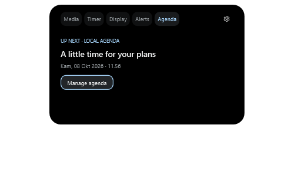
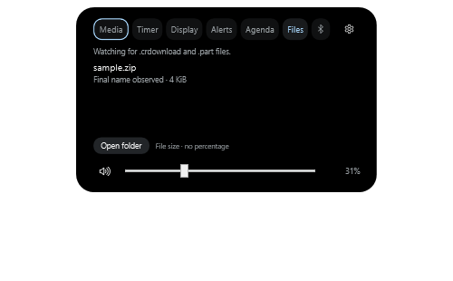
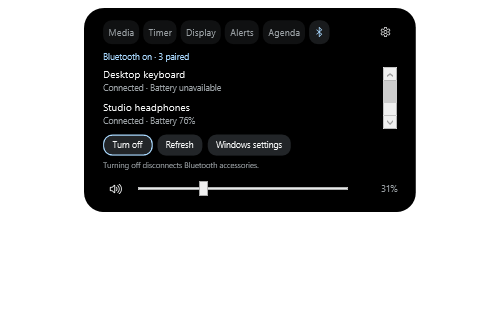

<div align="center">

<a href="src/WinNotch/Assets/WinNotch.ico">
  
</a>

# WinNotch

**Music, focus, and everyday controls. One quiet notch.**

A native Windows notch for music, timers, local plans, downloads, and device controls<br>
to one small space at the top of your screen.


[Preview](#see-it-in-action) · [Features](#small-space-useful-details) · [Get started](#get-started) · [Build](#build-from-source) · [Status](#current-status) · [Roadmap](#roadmap)


*Always available, rarely distracting.*

</div>

---

WinNotch sits against your screen's upper edge like an extension of the bezel. Start some music and it becomes a compact player. Change the volume or plug in your charger and it briefly shows what changed. Click it to open playback controls, then click away to return to your work.

Built with **C#, .NET 10, WPF, and native Windows APIs**. No browser engine, account, server, analytics, or runtime network dependency.

> [!NOTE]
> **v0.2.9 is a functional preview.** Each expanded module now loads when first selected and keeps its controls for later visits. Selecting an already active panel avoids repeated initialization. No account or additional dependency is needed. The ≤120 MB memory and <100 ms panel-response targets remain open. See [validation results and remaining limitations](VALIDATION.md).

## See it in action

| Music at a glance | A brief system moment |
| :---: | :---: |
|  |  |
| Track information stays close by. | An event appears, then the previous state returns. |

These media/charging captures are from the v0.1 UI smoke test; the timer is from v0.2.0 and preferences from v0.2.2. The charging capture uses a **test fixture**; normal operation shows live device events. The compact capture contains an active media session, rather than the empty idle notch.

| Local plans | Downloads | Bluetooth |
| :---: | :---: | :---: |
|  |  |  |
| Your next event, without an account. | Temporary files and observed completions. | Paired devices and available battery readings. |

These three captures are from the **v0.2.9 smoke test with synthetic events, files, and devices**. They illustrate the interface; they do not verify physical Bluetooth hardware or real browser downloads.

<details>
<summary><strong>A look at preferences</strong></summary>

<p align="center">
  
</p>

Choose an attached or floating shape, one of three sizes, a Leaf/Ice/Amber accent, near-black/true-black background, animation speed, and the visibility mode that fits your desktop. Modules can be enabled individually. Windows high contrast and reduced motion take precedence.

</details>

## Small space, useful details

| Notification detail (synthetic test) | Internal display brightness |
| :---: | :---: |
|  |  |

| Feature | What it does today |
| --- | --- |
| **Music controls** | Shows the active Windows media session's title, artist, and artwork, with play/pause, previous/next, and a read-only timeline. Available controls follow the player's capabilities. |
| **Battery moments** | Shows charger connection changes, low battery, full battery, and battery-saver events. |
| **Volume controls** | Adjusts system volume with a slider and mute button on either panel. Follows external changes and the default output device; controls disable when no output is available. Moving the slider preserves the mute state. |
| **Timer & Pomodoro** | Custom 1–180 minute countdowns, pause/resume/cancel, 25-minute focus and 5/15-minute break presets. Every fourth completed focus session offers a long break. |
| **Local calendar** | Add, edit, and delete one-time events. The Agenda tab shows the next event; optional silent reminders appear five minutes beforehand while WinNotch is open. |
| **Downloads** | Watches `.crdownload` and `.part` files in one folder. The Files tab lists temporary files and the five most recent observed completions, with file sizes and an Open folder action. |
| **Bluetooth** | Lists paired devices and their reported connection status. Shows battery levels when available, controls Bluetooth on/off after Windows permits it, and opens Windows Bluetooth settings. |
| **Brightness** | The Display tab controls a supported internal laptop screen through Windows WMI, regardless of notch placement. External changes produce a brief indicator. Unsupported screens disable the slider; external DDC/CI monitors are not supported. |
| **Notification previews** | After opt-in and Windows access, previews newly arrived notifications with a detail panel and local dismissal. Existing notifications are skipped. Portable delivery was verified with a real Windows test toast; denial/revocation still need manual checks. See [notification setup](packaging/README.md). |
| **Adaptive presence** | Fullscreen can hide everything, show only critical low-battery alerts, or show activity as usual. Presentations, locked/inactive desktops, and per-app exclusions always hide it. |
| **Idle clock** | Optional local time in the idle notch, using Windows' time format. Media and timers take priority; visibility rules still apply. Off by default. |
| **Your desktop, your settings** | Attached or floating style, three sizes, visibility modes, tray controls, and opt-in startup. |
| **Native interaction** | Passive events do not take focus. The expanded player supports keyboard interaction; the overlay stays out of the taskbar and Alt+Tab. |
| **Accessible motion and color** | Respects Windows reduced-motion preferences and includes high-contrast colors. |

Choose **Primary monitor**, **Follow active window**, or a specific display in Settings. A disconnected display falls back to primary; reconnecting restores the selection when Windows supplies the same display name. Follow mode stays in place while you interact with WinNotch. Placement and fullscreen detection use the selected display and Windows DPI.

Under **Display & app exclusions**, add an executable or enter names such as `chrome.exe`, one per line, then save. Remove a line and save to allow it again. The notch/tray menu also offers **Hide in [app.exe]** for the last active app and saves immediately. Rules match executable names exactly (ignoring case), apply to all instances, and hide the notch while that app is foreground. Timers keep running. WinNotch and the shared Windows ApplicationFrameHost cannot be excluded; inaccessible/protected process names cannot be matched.

A paused media session stays compact while Windows continues to expose it. The standard Windows volume flyout remains visible.

## Get started

The preview targets **Windows 11 x64**. The published portable executable includes the .NET runtime and does not require administrator access.

1. If you already have the portable build, keep its folder in a permanent location. Otherwise, [build it from source](#build-from-source).
2. Open `WinNotch.exe` (`dist\WinNotch\WinNotch.exe` after publishing locally).
3. Start playback in an app that exposes a Windows media session, then click the notch to open the player.

The `dist/` folder is generated locally and is excluded from Git; cloning the repository gives you the source, not the portable executable.

The single-file build is intentionally uncompressed (~158 MiB): this avoids the memory and startup cost measured with the previous compressed executable. No .NET runtime installation is needed.

### Everyday controls

| Action | Result |
| --- | --- |
| Click the notch | Open the active timer, or the media panel when no timer is active. |
| Choose **Media**, **Timer**, **Display**, **Alerts**, **Agenda**, **Files**, or the **Bluetooth icon** | Switch between enabled modules. Clicking a notification peek opens its detail; a calendar reminder opens Agenda, and a download alert opens Files. |
| Drag the volume slider / click the speaker | Change system volume / toggle mute. |
| Click outside or press **Escape** | Collapse the panel. |
| Right-click the notch or tray icon | Open the menu for settings, pause/resume, restart, and exit. Restart waits for the old process to exit and asks before cancelling an active timer. |
| Double-click the tray icon | Open settings. |
| Launch WinNotch again | Open the existing instance's settings. |
| Run `WinNotch.exe --settings` | Open settings on launch. |

**Smart hide** is the default: the idle notch hides over maximized title bars, while active media, timers, and brief events can still appear. Choose **Always visible** to keep the idle notch present, or **Only when active** for media, timers, and events.

On the **Timer** tab, choose a preset or enter a whole number of minutes. The countdown stays compact above media; transient battery/volume events return to it. Completion stays visible until **Done** or the next Pomodoro session. Each next session starts explicitly, so a break never starts without you. Completion is visual and silent. Fullscreen and Pause WinNotch hide the display without pausing the countdown; the completed state returns when the notch becomes visible. Timers run only while WinNotch is open; exiting or disabling the timer module cancels them.

Startup is opt-in through settings. It creates a per-user Windows Run entry pointing to the current executable; turn startup off before moving or deleting that executable.

<details>
<summary><strong>Calendar, Downloads, Bluetooth, and notification setup</strong></summary>

Open **Agenda → Manage agenda**, **Settings → Manage agenda**, or **Open agenda** in the tray menu. Enter a title, date, and 24-hour time, then add the event. Select a saved event to edit or delete it. Dates use the current local time zone; the saved instant stays fixed if the system time zone changes. Repeated or nonexistent daylight-saving times are rejected. Past events remain available until deleted; the local agenda holds up to 1,000 events.

Calendar is enabled by default and can be turned off in Settings without deleting events. It checks upcoming events every 15 seconds and stops its timer when disabled or no future events remain. Reminders are silent and appear once in the five-minute window before the event. Starting WinNotch or resuming within that window can show a reminder; events that have already started do not replay. Pause, exclusions, and fullscreen hiding suppress reminders without replaying them later. Events and consumed reminder status survive restart. Recurrence, cloud sync, and ICS import are not included.

Downloads is enabled by default and uses the Windows Downloads folder, including its configured redirected location. Under **Settings → Downloads**, choose another folder or restore the Windows default, then **Save changes**. **Files → Open folder** opens Explorer; no downloaded file is launched, altered, or removed. Missing or inaccessible folders show a status and retry every 30 seconds; **Retry** checks immediately.

Only `.crdownload` and `.part` files directly in that folder are tracked, with a limit of 32 temporary files shown. A temporary file may be active, paused, or interrupted; its observed file length is **not bytes received, a percentage, speed, or ETA**. Completion means WinNotch observed a rename from one of those temporary extensions to a final filename. Deletion/cancellation, ordinary copied files, existing final files, and downloads completed while WinNotch was closed do not generate completion alerts. Direct-to-final downloads, cross-folder moves, and unsupported temporary extensions are not detected. Folder-event loss triggers a rescan without guessing missed completions.

Download alerts follow pause, fullscreen, and app-exclusion rules and do not replay when suppression ends. Files remains accessible through the tray menu when allowed; disable the Downloads module to stop the watcher and clear the in-memory list. The module never reads file contents or browser history, and it does not verify a completed file's safety or integrity.

Open the **Bluetooth icon** or **Open Bluetooth** in the tray menu. The panel reads paired devices on opening, every 15 seconds while visible, and on **Refresh**. Classic and LE entries for the same Windows device container are combined. Up to 32 devices are shown; battery percentages appear only for connected devices when Windows provides a valid value. Missing battery information is shown as unavailable. No active discovery, pairing, GATT connection, or background connection alerts are included.

**Turn on / Turn off** changes the controllable Bluetooth radios. Windows may request permission on first use; denied access or hardware policy leaves a status message and the **Windows settings** shortcut available. Turning off disconnects Bluetooth accessories, including keyboards, mice, and audio. Success is shown only after reading back the requested radio state; an accepted but unconfirmed request asks you to refresh. Disabling the module stops its reads and leaves the radio unchanged. It does not control Wi-Fi or airplane mode.

For notifications, use **Settings → Notification previews → Allow access**, respond to the Windows prompt, enable previews, then save. Permission is never requested automatically. Denial leaves other features working. If Windows rejects the portable build, follow the [MSIX packaging notes](packaging/README.md); the generated package must be signed and trusted before installation. Dismissing a preview affects only WinNotch. The latest preview is cleared on disable, pause, exclusion, presentation, or fullscreen hiding; there is no stored notification history.

</details>

## Build from source

Requires Windows and the **.NET 10 SDK**. `global.json` selects SDK 10.0.100 with roll-forward to a later stable .NET 10 feature band. If `.tools/dotnet/dotnet.exe` exists, the build script uses it before the system SDK.

From the repository root, run:

```powershell
# Release build
.\build.ps1

# State/arbitration checks, then a Release build
.\build.ps1 -Check

# Checks, then a portable, self-contained x64 executable
.\build.ps1 -Check -Publish

# Launch the published app
.\dist\WinNotch\WinNotch.exe

# Optional: create an unsigned MSIX using the Windows SDK (does not install)
.\package.ps1
```

### Run the checks

Close any running WinNotch instance before the UI smoke test. Run desktop checks in a normal Windows desktop session.

<details>
<summary><strong>Desktop test commands, coverage, and measurement guidance</strong></summary>

```powershell
# UI/native smoke test against the published executable
.\dist\WinNotch\WinNotch.exe --smoke-test (Join-Path $PWD 'artifacts\smoke')

# Also make a small brightness change and restore it, then exercise restart
.\dist\WinNotch\WinNotch.exe --smoke-test (Join-Path $PWD 'artifacts\smoke-hardware') --brightness-test --restart-test

# Close WinNotch first. Measures idle, first expansion, and repeated use of enabled panels.
.\dist\WinNotch\WinNotch.exe --performance-test (Join-Path $PWD 'artifacts\performance')

# Then run a 15-minute stability check: 5 minutes of repeated panels/Settings, 10 minutes idle.
.\dist\WinNotch\WinNotch.exe --performance-test (Join-Path $PWD 'artifacts\stability') --stability-test

# Optional: remain open for 45 seconds after writing performance.json so memory can be inspected.
.\dist\WinNotch\WinNotch.exe --performance-test (Join-Path $PWD 'artifacts\memory') --memory-profile
# In another terminal, once performance.json exists:
$report = Get-Content 'artifacts\memory\performance.json' -Raw | ConvertFrom-Json
.\tests\Measure-MemoryMap.ps1 -ProcessId $report.processId -OutputPath 'artifacts\memory\resident-pages.json'

# After granting notification access and enabling previews: send one real test toast
powershell.exe -NoProfile -File .\tests\Send-NotificationTest.ps1
# Check that this test toast remains in Windows (does not send another)
powershell.exe -NoProfile -File .\tests\Send-NotificationTest.ps1 -CheckOnly

# Close WinNotch first. Requires access already granted and previews enabled.
# Sends two silent test toasts, exercises preview dismissal, checks Windows history, then exits.
.\dist\WinNotch\WinNotch.exe --notification-test (Join-Path $PWD 'artifacts\notification-live') (Join-Path $PWD 'tests\Send-NotificationTest.ps1')

# Native media integration checks: use the local SDK if present
$dotnet = if (Test-Path '.\.tools\dotnet\dotnet.exe') {
    '.\.tools\dotnet\dotnet.exe'
} else {
    'dotnet'
}
& $dotnet run --project tests\WinNotch.IntegrationChecks -c Release

# Audio control round-trip: temporarily silences output, then restores exact volume/mute
& $dotnet run --project tests\WinNotch.IntegrationChecks -c Release -- --controls-only
```

| Check | Coverage |
| --- | --- |
| **State/arbitration** | Priority, coalescing, expiry, restoration, suppression, visibility, display placement, elapsed-time countdowns, pause/resume, and a full Pomodoro cycle. |
| **UI smoke test** | Native window flags, passive-event focus behavior, state transitions, primary-display placement, module availability, and a short resource-use sample. Saves screenshots and a JSON report, then exits without saving settings. |
| **Performance sample** | Records working set, private bytes, managed allocations, normalized CPU, and panel timings before/after repeated interaction. Uses an isolated agenda, saves no preferences, makes no hardware writes, and never forces GC or trims memory. It opens Settings once without saving. |
| **Notification checks** | Smoke tests simulate denied/unspecified access, revocation during reads, disable/re-enable, and disposal without changing Windows permissions. The separate opt-in live test uses Windows PowerShell and Windows PowerShell ISE sender identities; it checks delivery, detail, dismissal, original retention, and no replay. Only controlled test previews are captured. |
| **Media integration** | Creates a temporary silent local media session to check metadata, artwork, playback state, and play/pause/next/previous. Refuses to issue controls if another session becomes current. Fixtures stay under `artifacts/integration`. |
| **Audio controls** | Verifies volume/mute writes with independent endpoint reads, callbacks, invalid inputs, and exact restoration in a finally block. Run when a brief silence is acceptable. |

The integration runner also opens a temporary window to verify real borderless fullscreen detection and the restore delay. Bring **WinNotch fullscreen test** to the foreground if Windows blocks programmatic activation. The window closes automatically.

For comparable performance samples, close running WinNotch instances and use `tests/Measure-Idle.ps1 -Executables @('path/to/old/WinNotch.exe', 'dist/WinNotch/WinNotch.exe') -SampleSeconds 20 -Rounds 2`. Use the same saved settings and permission state, and avoid building or opening Settings during sampling. `-KeepLastRunning` leaves the last process open so its live module status can be checked afterward. Reports include mean/peak sampled working set, private bytes, normalized CPU, and time to input-idle (a startup proxy, not full module readiness or cold boot). The script never trims working sets or forces collection.

Build from current source before using `--memory-profile`. `Measure-MemoryMap.ps1` reads resident-page metadata on 64-bit Windows and separates private from shareable pages; shareable does not mean another process currently uses the page. It never reads page contents or changes memory residency. The interaction benchmark releases its closed Settings window before the remaining samples. Capture resident pages **before** collecting a heap dump, because dump collection can page additional memory into the process. See the [memory investigation](docs/MEMORY-PROFILE.md) for findings and measurement limits.

Build from current source before using `--stability-test`. It adds about 15 minutes after the short benchmark, saving a sample every five seconds to `stability.csv` and a completion summary to `stability-result.json`. Ten cycles visit the enabled panels and open/close Settings without saving; later samples leave the app idle. Closed windows are tracked with weak references, without forcing collection. The repeated phase avoids activating its windows. A run with missing samples, a gap over 15 seconds, incomplete cycles, or Bluetooth polling after collapse fails rather than being counted as successful. Keep the computer awake during this check; it does not test sleep/resume.

The [15-minute stability results](docs/STABILITY.md) include reclaimed Settings windows, natural collection drops, and the remaining uncertainty about longer-term private memory growth.

[VALIDATION.md](VALIDATION.md) records the preview's checked results and the hardware/manual checks still needed. Short resource samples are not long-running performance guarantees.

</details>

## Current status

**Functional preview, with performance and hardware validation still in progress.** The latest recorded checks were run on 8 October 2026 on Windows 11 x64, using one laptop display at 125% scaling.

| Checkpoint | Recorded result |
| --- | --- |
| **v0.2.9 feature validation** | 233 checks passed: 105 core and 128 published UI/native checks. A real internal-display brightness change was read back and restored. |
| **Current source** | The diagnostic follow-up build passed 105 core checks with no warnings or errors. It does not replace the previously validated portable artifact. |
| **Memory after repeated use** | Corrected short benchmark: 158–161 MiB working set. The correction releases a reference in the test harness; it is not an application RAM improvement. |
| **15-minute stability check** | 178 samples, ten interaction cycles, all seven panels. Working set averaged 167.7 MiB and peaked at 173.0 MiB. All ten closed Settings windows were reclaimed; Bluetooth polling stopped after collapse. Longer-term private-memory growth remains unresolved. |
| **First expansion, including layout** | v0.2.9 release samples: 117.1–124.4 ms. This does not establish the <100 ms response target or animation completion time. |
| **Release readiness** | The ≤120 MB memory target remains unmet. Multi-hour use, physical sleep/resume, sustained 60 FPS, and broader hardware/accessibility checks remain open. The MSIX is unsigned and uninstalled. |

The short benchmark and stability run use different workloads; their memory figures are not a before/after comparison. Read the [feature and performance validation](VALIDATION.md), [memory investigation](docs/MEMORY-PROFILE.md), and [stability report](docs/STABILITY.md) for methods and limitations.

## Local by design

- Settings live in `%LOCALAPPDATA%\WinNotch\settings.json`.
- Local events and reminder status live in `%LOCALAPPDATA%\WinNotch\agenda.json`. Saves replace the file only after the new contents are written. An unreadable agenda is preserved with editing disabled; event titles never enter diagnostics. Smoke tests use an isolated agenda under their output folder.
- Download names and observed completions stay in memory and are never logged. Only the selected folder and module preference are saved. Download smoke checks use synthetic files in an isolated folder under `artifacts`.
- Bluetooth names and identifiers stay in memory; smoke tests use simulated devices and never request radio permission or change hardware. The optional `--bluetooth-read-test <output-folder>` diagnostic records only radio states and device counts.
- Media metadata stays in memory. Diagnostics record only timestamp, module, exception type, and HRESULT; titles, artists, artwork, and message text are not logged.
- Diagnostic logs rotate at approximately 128 KB.
- Notification access is requested only by the **Allow access** button. Notification content stays in memory and is never written to diagnostics. The smoke test uses synthetic previews and disposes the real listener before exercising the UI.

## Roadmap

This roadmap describes the public implementation plan. The local product brief is maintained separately and is not included in the repository.

| Milestone | Scope |
| --- | --- |
| **v0.2.9 · Current preview** | Deferred module controls, fewer repeated panel updates, and a repeatable interaction benchmark. Retains all previous modules. |
| **1 · Memory and longer sessions** | Investigate private/native memory after natural collections, then repeat longer sessions to assess growth and improvements against the ≤120 MB target. |
| **2 · Responsiveness** | Bring first-use panel response below 100 ms and measure sustained animation frame rate and cold startup. |
| **3 · Hardware and release checks** | Validate sleep/resume, the remaining device/accessibility cases below, and broader systems. Signed MSIX installation is a separate distribution step. |
| **Later · Extensibility** | Specify custom modules and the plugin API after the release checkpoint. Calendar currently uses local one-time events; Downloads observes one local folder. |
| **Validation still needed** | Active timer/media continuity through sleep, wake-up latency, physical charger/audio-device transitions, external media players, exclusive fullscreen games, startup on other systems, accessibility preferences, and physical mixed-DPI monitors. |

Physical Bluetooth on/off, its permission flow, and real-device battery reporting still need verification; simulated UI checks do not cover those behaviors. See [current results](#current-status) before treating the preview as release-ready.

## Under the hood

```text
src/WinNotch/
├── App.xaml.cs                Module wiring, lifecycle, and tray
├── ExpandedControls.xaml      Interactive panels, created on first expansion
├── AgendaWindow.xaml          Local event editor, created on demand
├── Core/                      Presentation state, countdown/Pomodoro, local settings
├── Modules/                   Media, battery, audio, brightness, notifications, downloads, Bluetooth, foreground
├── Native/                    Win32, Core Audio, and native tray interop
├── OverlayWindow.xaml         Notch layout
├── OverlayWindow.xaml.cs      Window behavior and animation
├── SettingsWindow.xaml        Preferences UI
├── SmokeTest.cs               UI/native smoke checks
└── PerformanceValidation.cs   Opt-in interaction and memory measurements
tests/
├── WinNotch.Checks/            Deterministic state checks
├── WinNotch.IntegrationChecks/ Native media, audio controls, and fullscreen checks
├── Measure-Idle.ps1            Reproducible process memory/startup samples
└── Measure-MemoryMap.ps1       Read-only resident-page breakdown
```

`NotchStateManager` owns the **Hidden → Idle → Peek → Compact → Expanded** presentation states and arbitrates expiring priority events. A charger event restores the previous media state without flashing an idle notch between them.

Media, battery, and audio use Windows events. Brightness uses non-overlapping WMI reads/writes off the UI thread, every two seconds when supported or 30 seconds when unavailable; disabling stops polling. Authorized notification previews poll every two seconds because desktop listener event subscriptions vary by Windows build. The idle clock schedules a tick at the next minute only while visible. The media timeline refreshes only while an actively playing expanded media panel is visible. `ForegroundService` listens for foreground/bounds changes and checks presentation mode on a two-second watchdog. `OverlayWindow` owns layout, animation, and native window styles, including `WS_EX_NOACTIVATE` for passive presentation.

The countdown uses elapsed milliseconds rather than counting UI callbacks. A one-second UI timer runs only during an active countdown; pausing or finishing stops it. On the Windows/.NET 10 target, `Environment.TickCount64` includes sleep and is independent of wall-clock edits. Revisit that choice when upgrading the target runtime: [.NET TickCount64 documentation](https://learn.microsoft.com/en-us/dotnet/api/system.environment.tickcount64?view=net-10.0). Physical sleep/resume remains a manual validation item.

Windows App SDK is not a dependency in this milestone; the Windows target framework and Win32 expose the APIs used here.

The tray uses the existing overlay HWND and WPF menu, avoiding a second UI framework. Fullscreen detection combines the active window's monitor/client bounds with explicit presentation and Direct3D states; an ambiguous Windows "busy" state alone cannot hide the notch. Placement uses `GetDpiForWindow`, recenters after display changes, and clamps the canvas on smaller displays.

<details>
<summary><strong>Native API references</strong></summary>

- [Call WinRT from desktop .NET](https://learn.microsoft.com/en-us/windows/apps/desktop/modernize/winrt-apis-desktop-apps)
- [System media sessions](https://learn.microsoft.com/en-us/uwp/api/windows.media.control.globalsystemmediatransportcontrolssessionmanager)
- [Core Audio endpoint notifications](https://learn.microsoft.com/en-us/windows/win32/api/endpointvolume/nn-endpointvolume-iaudioendpointvolumecallback)
- [Fullscreen/presentation notification state](https://learn.microsoft.com/en-us/windows/win32/api/shellapi/ne-shellapi-query_user_notification_state)
- [Notification listener](https://learn.microsoft.com/en-us/windows/apps/develop/notifications/app-notifications/notification-listener)
- [WMI brightness control](https://learn.microsoft.com/en-us/windows/win32/wmicoreprov/wmisetbrightness-method-in-class-wmimonitorbrightnessmethods)

</details>

## Help shape the preview

[Report a bug or suggest an improvement](https://github.com/Wahyusrg0819/WinNotch/issues). For a useful bug report, include your Windows version, display scaling, relevant media player or audio device, steps to reproduce, and expected behavior.

For code changes, run `.\build.ps1 -Check` and the desktop checks relevant to the change. Keep this roadmap and the [validation notes](VALIDATION.md) aligned with any changes to scope or verified behavior.
