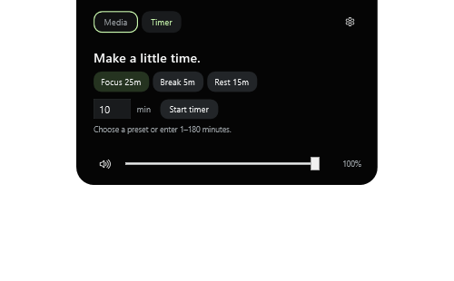
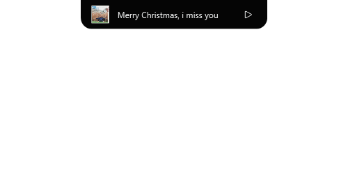
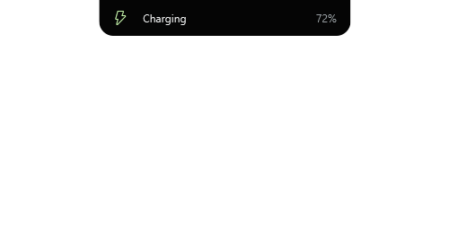
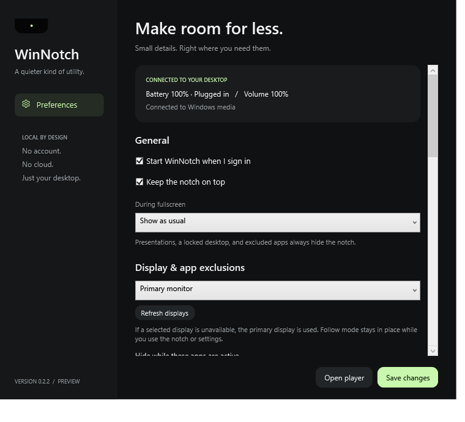
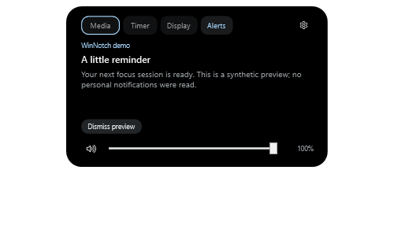
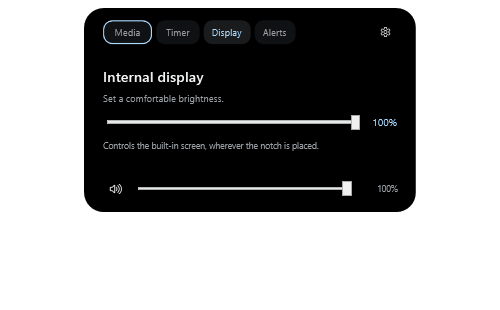

<div align="center">

<a href="src/WinNotch/Assets/WinNotch.ico">
  
</a>

# WinNotch

**A quiet place for what's playing.**

A native Windows notch that brings your music, timers, volume, and battery moments<br>
to one small space at the top of your screen.


[Preview](#see-it-in-action) · [Get started](#get-started) · [Build](#build-from-source) · [Roadmap](#roadmap) · [Validation](VALIDATION.md)



*Always available, rarely distracting.*

</div>

---

WinNotch sits against your screen's upper edge like an extension of the bezel. Start some music and it becomes a compact player. Change the volume or plug in your charger and it briefly shows what changed. Click it to open playback controls, then click away to return to your work.

Built with **C#, .NET 10, WPF, and native Windows APIs**. No browser engine, account, server, analytics, or runtime network dependency.

> [!NOTE]
> **v0.2.2 is a functional preview.** Adds internal-display brightness, accent themes, black level, animation speed, critical-only fullscreen alerts, an optional idle clock, restart, and opt-in notification previews. Live notification delivery was verified on the portable build after the user granted Windows access. An unsigned MSIX is also available for packaging validation. The ≤120 MB memory target is still open. See [validation results and remaining limitations](VALIDATION.md).

## See it in action

| Music at a glance | A brief system moment |
| :---: | :---: |
|  |  |
| Track information stays close by. | An event appears, then the previous state returns. |

These media/charging captures are from the v0.1 UI smoke test; the timer is from v0.2.0 and preferences from v0.2.2. The charging capture uses a **test fixture**; normal operation shows live device events. The compact capture contains an active media session, rather than the empty idle notch.

<details>
<summary><strong>A look at preferences</strong></summary>

<p align="center">
  
</p>

Choose an attached or floating shape, one of three sizes, a Leaf/Ice/Amber accent, near-black/true-black background, animation speed, and the visibility mode that fits your desktop. Modules can be enabled individually. Windows high contrast and reduced motion take precedence.

</details>

## Small space, useful details

| Notification detail (synthetic test) | Internal display brightness |
| :---: | :---: |
|  |  |

| Feature | What it does today |
| --- | --- |
| **Music controls** | Shows the active Windows media session's title, artist, and artwork, with play/pause, previous/next, and a read-only timeline. Available controls follow the player's capabilities. |
| **Battery moments** | Shows charger connection changes, low battery, full battery, and battery-saver events. |
| **Volume controls** | Adjusts system volume with a slider and mute button on either panel. Follows external changes and the default output device; controls disable when no output is available. Moving the slider preserves the mute state. |
| **Timer & Pomodoro** | Custom 1–180 minute countdowns, pause/resume/cancel, 25-minute focus and 5/15-minute break presets. Every fourth completed focus session offers a long break. |
| **Brightness** | The Display tab controls a supported internal laptop screen through Windows WMI, regardless of notch placement. External changes produce a brief indicator. Unsupported screens disable the slider; external DDC/CI monitors are not supported. |
| **Notification previews** | After opt-in and Windows access, previews newly arrived notifications with a detail panel and local dismissal. Existing notifications are skipped. Portable delivery was verified with a real Windows test toast; denial/revocation still need manual checks. See [notification setup](packaging/README.md). |
| **Adaptive presence** | Fullscreen can hide everything, show only critical low-battery alerts, or show activity as usual. Presentations, locked/inactive desktops, and per-app exclusions always hide it. |
| **Idle clock** | Optional local time in the idle notch, using Windows' time format. Media and timers take priority; visibility rules still apply. Off by default. |
| **Your desktop, your settings** | Attached or floating style, three sizes, visibility modes, tray controls, and opt-in startup. |
| **Native interaction** | Passive events do not take focus. The expanded player supports keyboard interaction; the overlay stays out of the taskbar and Alt+Tab. |
| **Accessible motion and color** | Respects Windows reduced-motion preferences and includes high-contrast colors. |

Choose **Primary monitor**, **Follow active window**, or a specific display in Settings. A disconnected display falls back to primary; reconnecting restores the selection when Windows supplies the same display name. Follow mode stays in place while you interact with WinNotch. Placement and fullscreen detection use the selected display and Windows DPI.

Under **Display & app exclusions**, add an executable or enter names such as `chrome.exe`, one per line, then save. Remove a line and save to allow it again. The notch/tray menu also offers **Hide in [app.exe]** for the last active app and saves immediately. Rules match executable names exactly (ignoring case), apply to all instances, and hide the notch while that app is foreground. Timers keep running. WinNotch and the shared Windows ApplicationFrameHost cannot be excluded; inaccessible/protected process names cannot be matched.

A paused media session stays compact while Windows continues to expose it. The standard Windows volume flyout remains visible.

## Get started

The preview targets **Windows 11 x64**. The published portable executable includes the .NET runtime and does not require administrator access.

1. If you already have the portable build, keep its folder in a permanent location. Otherwise, [build it from source](#build-from-source).
2. Open `WinNotch.exe` (`dist\WinNotch\WinNotch.exe` after publishing locally).
3. Start playback in an app that exposes a Windows media session, then click the notch to open the player.

The `dist/` folder is generated locally and is excluded from Git; cloning the repository gives you the source, not the portable executable.

The single-file build is intentionally uncompressed (~158 MiB): this avoids the memory and startup cost measured with the previous compressed executable. No .NET runtime installation is needed.

### Everyday controls

| Action | Result |
| --- | --- |
| Click the notch | Open the active timer, or the media panel when no timer is active. |
| Choose **Media**, **Timer**, **Display**, or **Alerts** | Switch between enabled modules. Clicking a notification peek opens its detail. |
| Drag the volume slider / click the speaker | Change system volume / toggle mute. |
| Click outside or press **Escape** | Collapse the panel. |
| Right-click the notch or tray icon | Open the menu for settings, pause/resume, restart, and exit. Restart waits for the old process to exit and asks before cancelling an active timer. |
| Double-click the tray icon | Open settings. |
| Launch WinNotch again | Open the existing instance's settings. |
| Run `WinNotch.exe --settings` | Open settings on launch. |

**Smart hide** is the default: the idle notch hides over maximized title bars, while active media, timers, and brief events can still appear. Choose **Always visible** to keep the idle notch present, or **Only when active** for media, timers, and events.

On the **Timer** tab, choose a preset or enter a whole number of minutes. The countdown stays compact above media; transient battery/volume events return to it. Completion stays visible until **Done** or the next Pomodoro session. Each next session starts explicitly, so a break never starts without you. Completion is visual and silent. Fullscreen and Pause WinNotch hide the display without pausing the countdown; the completed state returns when the notch becomes visible. Timers run only while WinNotch is open; exiting or disabling the timer module cancels them.

Startup is opt-in through settings. It creates a per-user Windows Run entry pointing to the current executable; turn startup off before moving or deleting that executable.

For notifications, use **Settings → Notification previews → Allow access**, respond to the Windows prompt, enable previews, then save. Permission is never requested automatically. Denial leaves other features working. If Windows rejects the portable build, follow the [MSIX packaging notes](packaging/README.md); the generated package must be signed and trusted before installation. Dismissing a preview affects only WinNotch. The latest preview is cleared on disable, pause, exclusion, presentation, or fullscreen hiding; there is no stored notification history.

## Build from source

Requires Windows and the **.NET 10 SDK**. `global.json` selects SDK 10.0.100 with roll-forward to a later stable .NET 10 feature band. If `.tools/dotnet/dotnet.exe` exists, the build script uses it before the system SDK.

From the repository root, run:

```powershell
# Release build
.\build.ps1

# State/arbitration checks, then a Release build
.\build.ps1 -Check

# Checks, then a portable, self-contained x64 executable
.\build.ps1 -Check -Publish

# Launch the published app
.\dist\WinNotch\WinNotch.exe

# Optional: create an unsigned MSIX using the Windows SDK (does not install)
.\package.ps1
```

### Run the checks

Close any running WinNotch instance before the UI smoke test. Run desktop checks in a normal Windows desktop session.

```powershell
# UI/native smoke test against the published executable
.\dist\WinNotch\WinNotch.exe --smoke-test (Join-Path $PWD 'artifacts\smoke')

# Also make a small brightness change and restore it, then exercise restart
.\dist\WinNotch\WinNotch.exe --smoke-test (Join-Path $PWD 'artifacts\smoke-hardware') --brightness-test --restart-test

# After granting notification access and enabling previews: send one real test toast
powershell.exe -NoProfile -File .\tests\Send-NotificationTest.ps1
# Check that this test toast remains in Windows (does not send another)
powershell.exe -NoProfile -File .\tests\Send-NotificationTest.ps1 -CheckOnly

# Native media integration checks: use the local SDK if present
$dotnet = if (Test-Path '.\.tools\dotnet\dotnet.exe') {
    '.\.tools\dotnet\dotnet.exe'
} else {
    'dotnet'
}
& $dotnet run --project tests\WinNotch.IntegrationChecks -c Release

# Audio control round-trip: temporarily silences output, then restores exact volume/mute
& $dotnet run --project tests\WinNotch.IntegrationChecks -c Release -- --controls-only
```

| Check | Coverage |
| --- | --- |
| **State/arbitration** | Priority, coalescing, expiry, restoration, suppression, visibility, display placement, elapsed-time countdowns, pause/resume, and a full Pomodoro cycle. |
| **UI smoke test** | Native window flags, passive-event focus behavior, state transitions, primary-display placement, module availability, and a short resource-use sample. Saves screenshots and a JSON report, then exits without saving settings. |
| **Media integration** | Creates a temporary silent local media session to check metadata, artwork, playback state, and play/pause/next/previous. Refuses to issue controls if another session becomes current. Fixtures stay under `artifacts/integration`. |
| **Audio controls** | Verifies volume/mute writes with independent endpoint reads, callbacks, invalid inputs, and exact restoration in a finally block. Run when a brief silence is acceptable. |

The integration runner also opens a temporary window to verify real borderless fullscreen detection and the restore delay. Bring **WinNotch fullscreen test** to the foreground if Windows blocks programmatic activation. The window closes automatically.

For comparable performance samples, close running WinNotch instances and use `tests/Measure-Idle.ps1 -Executables @('path/to/old/WinNotch.exe', 'dist/WinNotch/WinNotch.exe')`. It launches and closes only the specified test processes and never trims their working sets or forces collection.

[VALIDATION.md](VALIDATION.md) records the preview's checked results and the hardware/manual checks still needed. Short resource samples are not long-running performance guarantees.

## Local by design

- Settings live in `%LOCALAPPDATA%\WinNotch\settings.json`.
- Media metadata stays in memory. Diagnostics record only timestamp, module, exception type, and HRESULT; titles, artists, artwork, and message text are not logged.
- Diagnostic logs rotate at approximately 128 KB.
- Notification access is requested only by the **Allow access** button. Notification content stays in memory and is never written to diagnostics. The smoke test uses synthetic previews and disposes the real listener before exercising the UI.

## Roadmap

The [product brief](prd.md) describes the broader vision. This README describes the implemented preview.

| Milestone | Scope |
| --- | --- |
| **v0.2.2 · Current preview** | Notification preview implementation and packaging path; verified laptop brightness, themes/black level/speed, critical-only fullscreen policy, idle clock, and restart. Includes earlier multi-monitor, exclusion, timer, audio, and media features. |
| **Next validation** | Notification denial/revocation, more app/Windows combinations, and signed MSIX installation; long-running resource/stability checks and the ≤120 MB memory target. |
| **Later PRD modules** | Calendar, Downloads, Bluetooth, custom modules, and plugin API need more detailed requirements. |
| **Validation still needed** | Physical charger/audio-device transitions, external media players, exclusive fullscreen games, login startup, accessibility preferences, and physical mixed-DPI monitors. |

The v0.1.1 packaging/tray changes reduced measured idle memory from about **303 to 135 MiB**. The ≤120 MB target remains open, and cold boot startup and sustained 60 FPS still need measurement. See [performance measurements and their limits](VALIDATION.md).

## Under the hood

```text
src/WinNotch/
├── App.xaml.cs                Module wiring, lifecycle, and tray
├── Core/                      Presentation state, countdown/Pomodoro, local settings
├── Modules/                   Media, battery, audio, brightness, notifications, foreground
├── Native/                    Win32, Core Audio, and native tray interop
├── OverlayWindow.xaml         Notch layout
├── OverlayWindow.xaml.cs      Window behavior and animation
├── SettingsWindow.xaml        Preferences UI
└── SmokeTest.cs               UI/native smoke checks
tests/
├── WinNotch.Checks/            Deterministic state checks
├── WinNotch.IntegrationChecks/ Native media, audio controls, and fullscreen checks
└── Measure-Idle.ps1            Reproducible process memory/startup samples
```

`NotchStateManager` owns the **Hidden → Idle → Peek → Compact → Expanded** presentation states and arbitrates expiring priority events. A charger event restores the previous media state without flashing an idle notch between them.

Media, battery, and audio use Windows events. Brightness uses non-overlapping WMI reads/writes off the UI thread, every two seconds when supported or 30 seconds when unavailable; disabling stops polling. Authorized notification previews poll every two seconds because desktop listener event subscriptions vary by Windows build. The idle clock schedules a tick at the next minute only while visible. The media timeline refreshes only while an actively playing expanded media panel is visible. `ForegroundService` listens for foreground/bounds changes and checks presentation mode on a two-second watchdog. `OverlayWindow` owns layout, animation, and native window styles, including `WS_EX_NOACTIVATE` for passive presentation.

The countdown uses elapsed milliseconds rather than counting UI callbacks. A one-second UI timer runs only during an active countdown; pausing or finishing stops it. On the Windows/.NET 10 target, `Environment.TickCount64` includes sleep and is independent of wall-clock edits. Revisit that choice when upgrading the target runtime: [.NET TickCount64 documentation](https://learn.microsoft.com/en-us/dotnet/api/system.environment.tickcount64?view=net-10.0). Physical sleep/resume remains a manual validation item.

Windows App SDK is not a dependency in this milestone; the Windows target framework and Win32 expose the APIs used here.

The tray uses the existing overlay HWND and WPF menu, avoiding a second UI framework. Fullscreen detection combines the active window's monitor/client bounds with explicit presentation and Direct3D states; an ambiguous Windows "busy" state alone cannot hide the notch. Placement uses `GetDpiForWindow`, recenters after display changes, and clamps the canvas on smaller displays.

<details>
<summary><strong>Native API references</strong></summary>

- [Call WinRT from desktop .NET](https://learn.microsoft.com/en-us/windows/apps/desktop/modernize/winrt-apis-desktop-apps)
- [System media sessions](https://learn.microsoft.com/en-us/uwp/api/windows.media.control.globalsystemmediatransportcontrolssessionmanager)
- [Core Audio endpoint notifications](https://learn.microsoft.com/en-us/windows/win32/api/endpointvolume/nn-endpointvolume-iaudioendpointvolumecallback)
- [Fullscreen/presentation notification state](https://learn.microsoft.com/en-us/windows/win32/api/shellapi/ne-shellapi-query_user_notification_state)
- [Notification listener](https://learn.microsoft.com/en-us/windows/apps/develop/notifications/app-notifications/notification-listener)
- [WMI brightness control](https://learn.microsoft.com/en-us/windows/win32/wmicoreprov/wmisetbrightness-method-in-class-wmimonitorbrightnessmethods)

</details>

## Help shape the preview

[Report a bug or suggest an improvement](https://github.com/Wahyusrg0819/WinNotch/issues). For a useful bug report, include your Windows version, display scaling, relevant media player or audio device, steps to reproduce, and expected behavior.

For code changes, run `.\build.ps1 -Check` and the desktop checks relevant to the change. Keep the [product brief](prd.md) and [validation notes](VALIDATION.md) aligned with any changes to scope or verified behavior.
