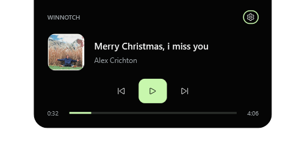

<div align="center">

# WinNotch

**A quiet place for what's playing.**

A native Windows notch that brings your music, volume, and battery moments<br>
to one small space at the top of your screen.


[Preview](#see-it-in-action) · [Get started](#get-started) · [Build](#build-from-source) · [Roadmap](#roadmap) · [Validation](VALIDATION.md)



*Always available, rarely distracting.*

</div>

---

WinNotch sits against your screen's upper edge like an extension of the bezel. Start some music and it becomes a compact player. Change the volume or plug in your charger and it briefly shows what changed. Click it to open playback controls, then click away to return to your work.

Built with **C#, .NET 10, WPF, and native Windows APIs**. No browser engine, account, server, analytics, or runtime network dependency.

> [!NOTE]
> **v0.1 is a functional preview.** Media, battery, and volume are implemented; notifications and timers are planned. Memory use is above the product's ≤120 MB target. See [validation results and remaining limitations](VALIDATION.md).

## See it in action

| Music at a glance | A brief system moment |
| :---: | :---: |
|  |  |
| Track information stays close by. | An event appears, then the previous state returns. |

These are captures of the app from the UI smoke test. The charging capture uses a **test fixture**; normal operation shows live device events. The compact capture contains an active media session, rather than the empty idle notch.

<details>
<summary><strong>A look at preferences</strong></summary>

<p align="center">
  
</p>

Choose an attached or floating shape, one of three sizes, and the visibility mode that fits your desktop. Media, battery, and volume modules can be enabled individually.

</details>

## Small space, useful details

| Feature | What it does today |
| --- | --- |
| **Music controls** | Shows the active Windows media session's title, artist, and artwork, with play/pause, previous/next, and a read-only timeline. Available controls follow the player's capabilities. |
| **Battery moments** | Shows charger connection changes, low battery, full battery, and battery-saver events. |
| **Volume feedback** | Shows volume and mute changes through Core Audio callbacks, including changes to the default audio device. |
| **Adaptive presence** | Smart hide keeps the idle notch away from maximized title bars. Optional fullscreen/presentation hiding lets it step aside. |
| **Your desktop, your settings** | Attached or floating style, three sizes, visibility modes, tray controls, and opt-in startup. |
| **Native interaction** | Passive events do not take focus. The expanded player supports keyboard interaction; the overlay stays out of the taskbar and Alt+Tab. |
| **Accessible motion and color** | Respects Windows reduced-motion preferences and includes high-contrast colors. |

The notch is positioned on the **primary monitor** and scales with Windows DPI. A paused media session stays compact while Windows continues to expose it. The standard Windows volume flyout remains visible.

## Get started

The preview targets **Windows 11 x64**. The published portable executable includes the .NET runtime and does not require administrator access.

1. If you already have the portable build, keep its folder in a permanent location. Otherwise, [build it from source](#build-from-source).
2. Open `WinNotch.exe` (`dist\WinNotch\WinNotch.exe` after publishing locally).
3. Start playback in an app that exposes a Windows media session, then click the notch to open the player.

The `dist/` folder is generated locally and is excluded from Git; cloning the repository gives you the source, not the portable executable.

### Everyday controls

| Action | Result |
| --- | --- |
| Click the notch | Open the player. |
| Click outside or press **Escape** | Collapse the player. |
| Right-click the notch or tray icon | Open the menu for settings, pause/resume, and exit. |
| Double-click the tray icon | Open settings. |
| Launch WinNotch again | Open the existing instance's settings. |
| Run `WinNotch.exe --settings` | Open settings on launch. |

**Smart hide** is the default: the idle notch hides over maximized title bars, while active media and brief events can still appear. Choose **Always visible** to keep the idle notch present, or **Only when active** for media and events.

Startup is opt-in through settings. It creates a per-user Windows Run entry pointing to the current executable; turn startup off before moving or deleting that executable.

## Build from source

Requires Windows and the **.NET 10 SDK**. `global.json` selects SDK 10.0.100 with roll-forward to a later stable .NET 10 feature band. If `.tools/dotnet/dotnet.exe` exists, the build script uses it before the system SDK.

From the repository root, run:

```powershell
# Release build
.\build.ps1

# State/arbitration checks, then a Release build
.\build.ps1 -Check

# Checks, then a portable, self-contained x64 executable
.\build.ps1 -Check -Publish

# Launch the published app
.\dist\WinNotch\WinNotch.exe
```

### Run the checks

Close any running WinNotch instance before the UI smoke test. Run desktop checks in a normal Windows desktop session.

```powershell
# UI/native smoke test against the published executable
.\dist\WinNotch\WinNotch.exe --smoke-test (Join-Path $PWD 'artifacts\smoke')

# Native media integration checks: use the local SDK if present
$dotnet = if (Test-Path '.\.tools\dotnet\dotnet.exe') {
    '.\.tools\dotnet\dotnet.exe'
} else {
    'dotnet'
}
& $dotnet run --project tests\WinNotch.IntegrationChecks -c Release
```

| Check | Coverage |
| --- | --- |
| **State/arbitration** | Priority, coalescing, expiry, restoration, suppression, visibility policies, and pause/resume. |
| **UI smoke test** | Native window flags, passive-event focus behavior, state transitions, primary-display placement, module availability, and a short resource-use sample. Saves screenshots and a JSON report, then exits without saving settings. |
| **Media integration** | Creates a temporary silent local media session to check metadata, artwork, playback state, and play/pause/next/previous. Refuses to issue controls if another session becomes current. Fixtures stay under `artifacts/integration`. |

[VALIDATION.md](VALIDATION.md) records the preview's checked results and the hardware/manual checks still needed. Short resource samples are not long-running performance guarantees.

## Local by design

- Settings live in `%LOCALAPPDATA%\WinNotch\settings.json`.
- Media metadata stays in memory. Diagnostics record only timestamp, module, exception type, and HRESULT; titles, artists, artwork, and message text are not logged.
- Diagnostic logs rotate at approximately 128 KB.
- This release does not request notification access.

## Roadmap

The [product brief](prd.md) describes the broader vision. This README describes the implemented preview.

| Milestone | Scope |
| --- | --- |
| **v0.1 · Current preview** | Notch shell, media controls, battery/charger events, volume/mute feedback, primary-monitor positioning, tray, and local preferences. |
| **v0.2 · Planned** | Notifications, timers, brightness, per-app exclusions, and follow-active-monitor mode. |
| **Validation still needed** | Physical charger/audio-device transitions, external media players, exclusive fullscreen games, login startup, accessibility preferences, and physical mixed-DPI monitors. |

Memory optimization remains necessary: the recorded idle sample measured **298.5 MiB working set**, above the PRD's ≤120 MB target. Startup under two seconds and sustained 60 FPS have not been benchmarked. See [the full performance notes](VALIDATION.md#performance-remains-a-preview-limitation).

## Under the hood

```text
src/WinNotch/
├── App.xaml.cs                Module wiring, lifecycle, and tray
├── Core/                      Presentation state and local settings
├── Modules/                   Media, battery, audio, and foreground events
├── Native/                    Win32 and Core Audio interop
├── OverlayWindow.xaml         Notch layout
├── OverlayWindow.xaml.cs      Window behavior and animation
├── SettingsWindow.xaml        Preferences UI
└── SmokeTest.cs               UI/native smoke checks
tests/
├── WinNotch.Checks/            Deterministic state checks
└── WinNotch.IntegrationChecks/ Native media checks
```

`NotchStateManager` owns the **Hidden → Idle → Peek → Compact → Expanded** presentation states and arbitrates expiring priority events. A charger event restores the previous media state without flashing an idle notch between them.

Modules use Windows events. The media timeline refreshes only while an actively playing expanded panel is visible. `ForegroundService` listens for foreground/bounds changes and checks presentation mode on a two-second watchdog. `OverlayWindow` owns layout, animation, and native window styles, including `WS_EX_NOACTIVATE` for passive presentation.

Windows App SDK is not a dependency in this milestone; the Windows target framework and Win32 expose the APIs used here.

<details>
<summary><strong>Native API references</strong></summary>

- [Call WinRT from desktop .NET](https://learn.microsoft.com/en-us/windows/apps/desktop/modernize/winrt-apis-desktop-apps)
- [System media sessions](https://learn.microsoft.com/en-us/uwp/api/windows.media.control.globalsystemmediatransportcontrolssessionmanager)
- [Core Audio endpoint notifications](https://learn.microsoft.com/en-us/windows/win32/api/endpointvolume/nn-endpointvolume-iaudioendpointvolumecallback)
- [Fullscreen/presentation notification state](https://learn.microsoft.com/en-us/windows/win32/api/shellapi/ne-shellapi-query_user_notification_state)

</details>

## Help shape the preview

[Report a bug or suggest an improvement](https://github.com/Wahyusrg0819/WinNotch/issues). For a useful bug report, include your Windows version, display scaling, relevant media player or audio device, steps to reproduce, and expected behavior.

For code changes, run `.\build.ps1 -Check` and the desktop checks relevant to the change. Keep the [product brief](prd.md) and [validation notes](VALIDATION.md) aligned with any changes to scope or verified behavior.
